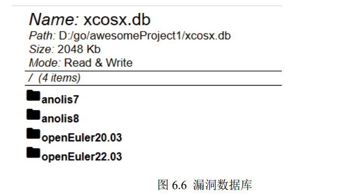
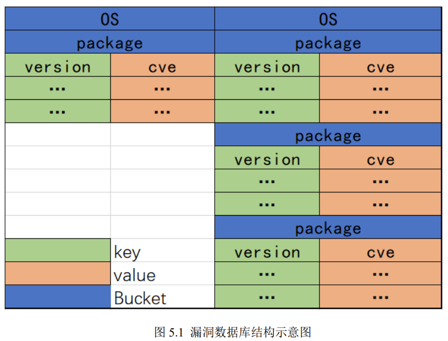

# xcosx_db

通过本项目可以拉取华为欧拉和阿里龙蜥公布的CVE漏洞信息，并进行解析，构建可以用于漏洞检测的漏洞库。

配合xcosx使用，生成xcos_db.db为Bolt数据库

华为欧拉安全公告 https://repo.openeuler.org/security/data

阿里龙蜥安全公告 https://anas.openanolis.cn/api/data/OVAL

## 使用

可以使用已经编译好的可执行程序

linux: `./xcosx_db`

windows: `./xcosx_db.exe`

# 漏洞库结构

 

# TODO
1. 漏洞库自动更新
2. 新增而不是全量替换
3. 支持腾讯OpenCloud系统 https://security.opencloudos.tech/cve/oc8.xml